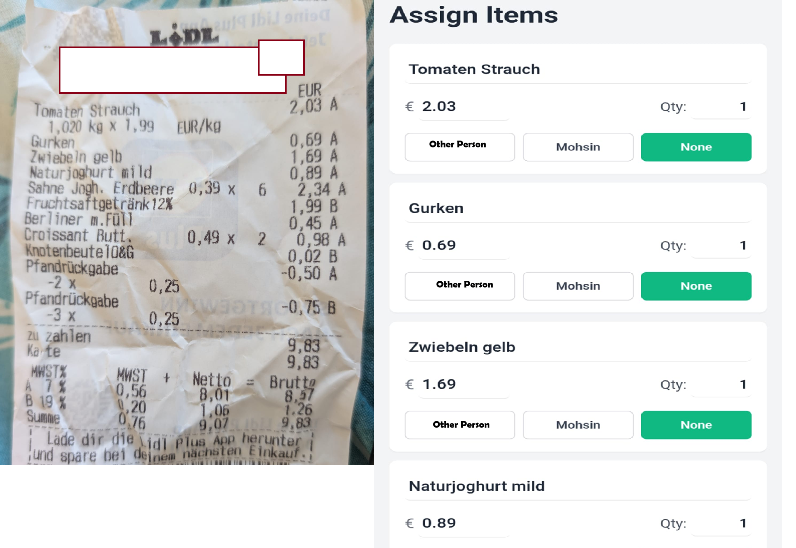

# 📊 Lidl-to-CSV Shared Expense Tracker

An elegant, mobile-friendly application to track shared expenses. You can add expenses manually or scan receipt images to automatically extract items, costs, and quantities using Google Gemini, then sync them directly to a Google Sheet.

<div align="center">
  
</div>

---

## 🛠️ Step-by-Step Deployment Guide

To get the app fully functional in production, you need to deploy three components:
1. **Google Sheets Integration** (receives and stores expenses)
2. **Gemini OCR Backend** (processes receipt images)
3. **Frontend Application** (deployed on Vercel)

---

### 1️⃣ Google Sheets Setup & Deployment (`GOOGLE_APP_SCRIPT_URL`)

This application uses a Google Sheets spreadsheet as its database. You will deploy a Google Apps Script that acts as a web API for the spreadsheet.

1. **Create your Google Sheet**:
   - Create a new Google Sheet.
   - Rename the active sheet tab to exactly `Expenses`.
   - Add the following headers in row 1: `Item`, `Cost`, `Person Responsible`, `Date`, `Quantity`.
2. **Open Apps Script**:
   - In the Google Sheet menu, go to **Extensions** > **Apps Script**.
3. **Add the Script Code**:
   - Delete any placeholder code in the script editor.
   - Open the [google_sheets_link_script](google_sheets_link_script) file from this codebase.
   - Copy the entire content and paste it into the Apps Script editor.
   - Save the project (e.g., name it `Lidl-to-CSV API`).
4. **Deploy as a Web App**:
   - Click the **Deploy** button in the top right, then select **New deployment**.
   - Click the gear icon next to "Select type" and choose **Web app**.
   - Fill in the configuration:
     - **Description**: `Lidl Expense API`
     - **Execute as**: `Me (your-email@gmail.com)`
     - **Who has access**: `Anyone` *(This is required so the Vercel backend proxy can communicate with it)*.
   - Click **Deploy**.
   - Authorize permissions if prompted by Google.
   - **Copy the Web App URL** (e.g., `https://script.google.com/macros/s/.../exec`). This is your **`GOOGLE_APP_SCRIPT_URL`**.

---

### 2️⃣ OCR Backend Deployment (`OCR_BACKEND_URL`)

The backend script in [Gemini/main.py](Gemini/main.py) is a FastAPI service that communicates with Google's Generative AI to scan receipts. You can deploy it to any cloud provider supporting Python (e.g., Render, Railway, Fly.io, or Hugging Face Spaces).

1. **Choose a Hosting Provider** (e.g., [Render.com](https://render.com)):
   - Create a Web Service connected to your repository, or deploy the folder `Gemini/` as a standalone python service.
   - **Build Command**: `pip install -r requirements.txt` *(Note: create a `requirements.txt` containing `fastapi`, `uvicorn`, `google-generativeai`, `python-dotenv`, `pillow`, `python-multipart`)*
   - **Start Command**: `uvicorn main:app --host 0.0.0.0 --port 8000`
2. **Configure Environment Variables**:
   Add the following environment variables in your hosting provider's dashboard:
   - **`Gemini_key`**: Your Google AI Studio API Key (Get one from [Google AI Studio](https://aistudio.google.com/)).
   - **`Model_name`**: The model you wish to use (e.g., `gemini-2.5-flash`).
3. **Copy the App URL**:
   - Once successfully deployed, copy the public URL of your service (e.g., `https://my-ocr-backend.onrender.com`). This is your **`OCR_BACKEND_URL`**.

---

### 3️⃣ Frontend Deployment on Vercel

The frontend and Vercel serverless API handlers reside in the root directory.

> [!NOTE]
> We have configured a `.vercelignore` file to automatically exclude the `Gemini/` python directory and `google_sheets_link_script` from the Vercel upload, keeping the production deployment bundle clean and lightweight.

1. **Deploy to GitHub**:
   - Push your repository to your GitHub account.
2. **Import to Vercel**:
   - Log in to [Vercel](https://vercel.com) and click **Add New** > **Project**.
   - Import your repository.
3. **Configure Environment Variables**:
   Under the **Environment Variables** section, add:
   - **`GOOGLE_APP_SCRIPT_URL`**: The web app URL copied from **Step 1**.
   - **`OCR_BACKEND_URL`**: The API service URL copied from **Step 2** (do *not* include a trailing slash).
4. **Deploy**:
   - Click **Deploy**. Vercel will build the React application and deploy the serverless functions in the `api/` folder.

---

## 💻 Local Development

If you want to run the entire stack locally for testing:

### 1. Run the Frontend (Vite + Express Proxy)
1. Install dependencies:
   ```bash
   npm install
   ```
2. Create a `.env.local` file in the root directory:
   ```env
   GOOGLE_APP_SCRIPT_URL=your_google_script_url
   OCR_BACKEND_URL=http://localhost:8000
   ```
3. Run the development server:
   ```bash
   npm run dev
   ```

### 2. Run the Gemini OCR Backend
1. Navigate to the `Gemini` directory:
   ```bash
   cd Gemini
   ```
2. Create a `.env` file inside the `Gemini` directory:
   ```env
   Gemini_key=your_gemini_api_key
   Model_name=gemini-2.5-flash
   ```
3. Install Python dependencies and run the server:
   ```bash
   pip install fastapi uvicorn google-generativeai python-dotenv pillow python-multipart
   python main.py
   ```
   The backend will start running at `http://127.0.0.1:8000`.


### Contributors
- **[Muhammad Waleed Gul](https://github.com/waleedgul92)**
